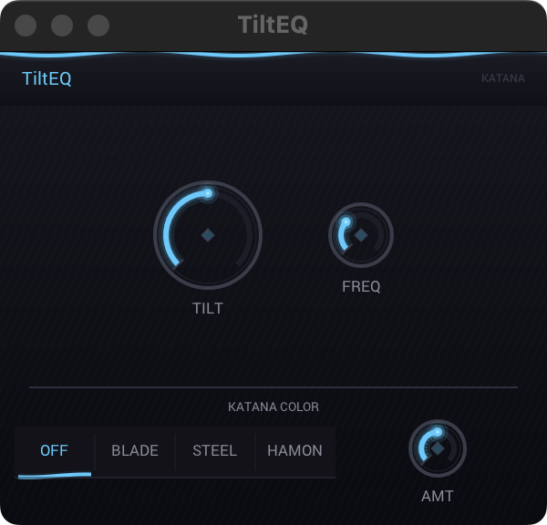
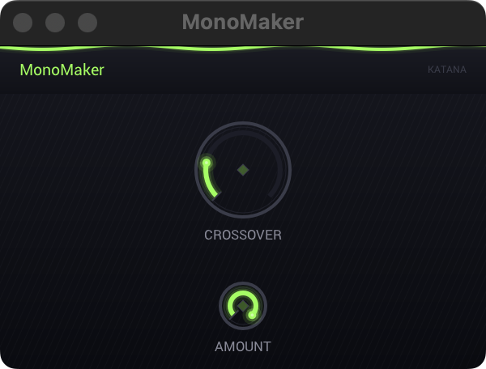
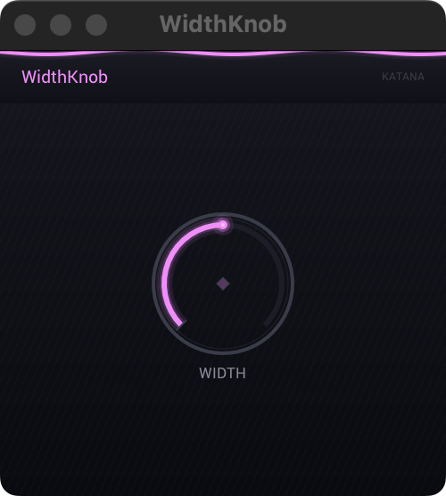
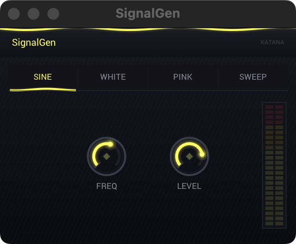
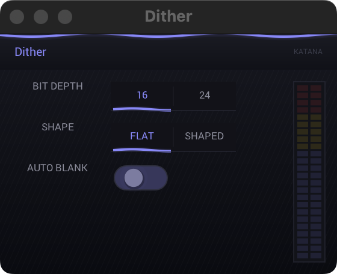
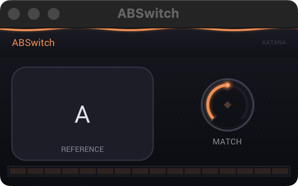
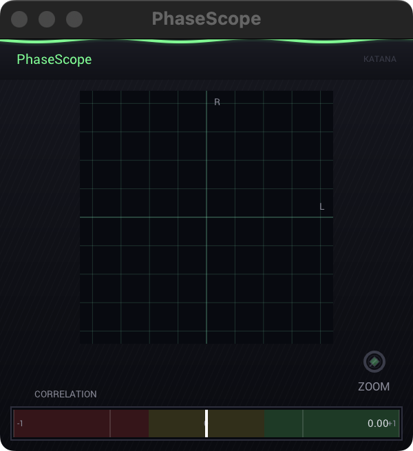
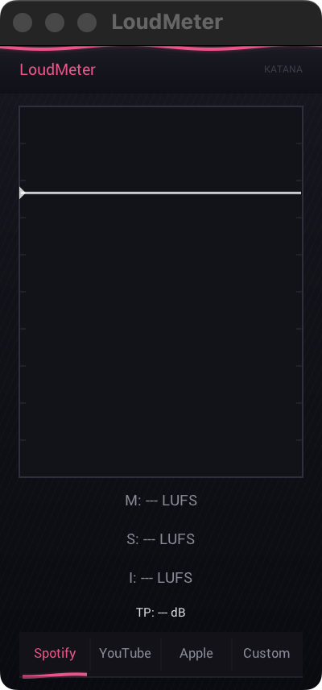

# RemmaAudio Free Plugin Suite

**8 free audio plugins for macOS** (VST3 / AU)

High-quality mixing and mastering utilities built with the iPlug2 framework. No sign-up, no DRM, no strings attached.

---

## Plugins

| Plugin         | Description                                                            |
| -------------- | ---------------------------------------------------------------------- |
| **TiltEQ**     | One-knob tilt EQ - balance lows vs highs with a single control         |
| **MonoMaker**  | Mono fold below frequency - collapse stereo below a crossover point    |
| **WidthKnob**  | One-knob stereo width - M/S processing with Haas effect                |
| **SignalGen**  | Test signal generator - Sine, White noise, Pink noise, Sweep           |
| **Dither**     | Mastering dither - TPDF dither with noise shaping (16/24-bit)          |
| **ABSwitch**   | A/B comparison switch with gain matching and crossfade                 |
| **PhaseScope** | Phase correlation meter with Lissajous display                         |
| **LoudMeter**  | LUFS/LKFS loudness meter with target presets (Spotify, YouTube, Apple) |

## Screenshots

<p align="center">
  
  
  
</p>
<p align="center">
  
  
  
</p>
<p align="center">
  
  
</p>

## Download & Install

1. Download **RemmaAudio-free-1.0.0.pkg** from [Releases](https://github.com/rrrrnmtsu/remma-audio-free/releases/latest)
2. Double-click the `.pkg` file to run the installer
3. If macOS blocks the installer (Gatekeeper):
   - Go to **System Settings > Privacy & Security**
   - Scroll down and click **"Open Anyway"**
4. Restart your DAW - plugins appear under **RemmaAudio** in VST3/AU lists

### Uninstall

Remove the following directories:

```
~/Library/Audio/Plug-Ins/VST3/RemmaAudio/
~/Library/Audio/Plug-Ins/Components/RemmaAudio/
```

## System Requirements

- **OS**: macOS 10.15 (Catalina) or later
- **Architecture**: Intel & Apple Silicon (Universal Binary)
- **Formats**: VST3, AU
- **DAW**: Logic Pro, Ableton Live, FL Studio, Reaper, Studio One, Cubase, etc.

## License

MIT License - Free for personal and commercial use. See [LICENSE](LICENSE) for details.

## About RemmaAudio

Independent audio plugin developer focused on practical, lightweight tools for music production. More plugins coming soon at [remma-audio.com](https://remma-audio.com).

---

Made with iPlug2 | Built on macOS
